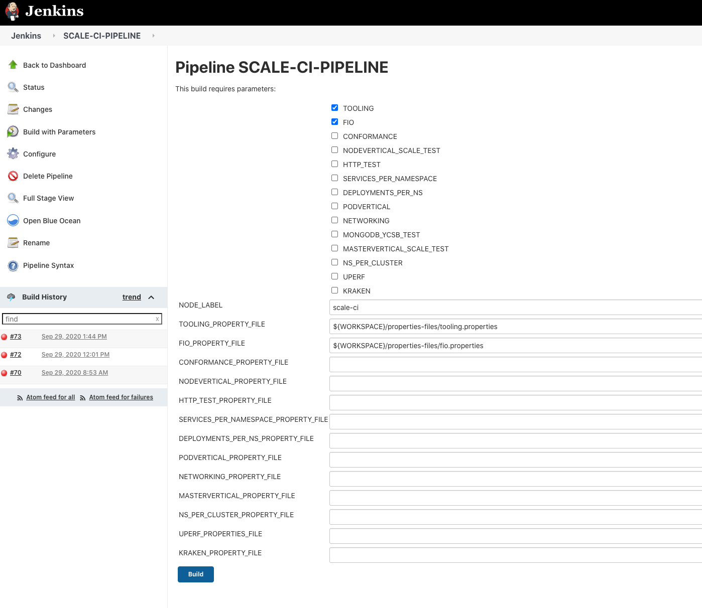

<!-- START doctoc generated TOC please keep comment here to allow auto update -->
<!-- DON'T EDIT THIS SECTION, INSTEAD RE-RUN doctoc TO UPDATE -->
**Table of Contents**  *generated with [DocToc](https://github.com/thlorenz/doctoc)*

- [workload-automation-setup](#workload-automation-setup)
- [Scale-CI Jobs](#scale-ci-jobs)
  - [Dependencies](#dependencies)
    - [Jenkins Server and Bootstrap Dependencies](#jenkins-server-and-bootstrap-dependencies)
      - [Manual Steps](#manual-steps)
    - [Orchestration Host Dependencies](#orchestration-host-dependencies)
  - [Bootstrapping Workloads on Jenkins](#bootstrapping-workloads-on-jenkins)
    - [Assumptions](#assumptions)
    - [Bootstrap Script and Workload Execution](#bootstrap-script-and-workload-execution)

<!-- END doctoc generated TOC please keep comment here to allow auto update -->

# Workload Automation

This repo has the scripts that is used to ease the on-boarding process of workloads into a new environment. 

It has the necessary process and scripts to bootstrap a Jenkins environment with the identified workloads.

# Scale-CI Jobs

The workloads are selected to test and report on the following categories,

1. Control Plane Density
2. Data Plane Density
3. Cluster limits
4. OCP Application Router

TODO: Kraken is a possible choice for defining and implementing specific choas injection scenarios.

Following are the workloads identified,

Job   | OCP component/category | Description | 
----------------- | --------- | -------------------- |   
Node Vertical | Data plane density and Cluster Limits | Creates max pods per compute node | 
Master Vertical | Control plane density | Creates bunch of objects to stress ApiServer, Etcd and Controller |   
HTTP | Router | Data-plane workload generator that runs http requests through HAProxy into deployed pods |   
Pod Vertical | Cluster Limits | Tests pods per namespace limit |   
Deployments per namespaces | Cluster Limits | Tests deployments per namespace limit |   
Services per namespace | Cluster Limits | Tests maximum number of services possible per namespace | 
Namespaces per cluster | Cluster Limits | Tests namespaces per cluster limit |   
Kraken | Base/Idle cluster | Injects chaos scenarios into the cluster

## Dependencies

### Jenkins Server and Bootstrap Dependencies

Following are the dependencies required _before_ you run the `bootstrap.sh` file,
 
- Jenkins server
- Python Packages and Binaries
  - Jenkins Job Builder
  - Java Runtime
  - git
  
Python Packages and Binaries can be installed using the following commands,

```
sudo dnf install wget git -y
sudo wget http://pkg.jenkins-ci.org/redhat-stable/jenkins.repo -O /etc/yum.repos.d/jenkins.repo
sudo rpm --import https://pkg.jenkins.io/redhat/jenkins.io.key
sudo dnf install -y java-11-openjdk-devel
sudo pip3 install jenkins-job-builder
sudo dnf install jenkins -y
sudo systemctl enable jenkins
sudo systemctl start jenkins
sudo systemctl status jenkins
sudo firewall-cmd --permanent --add-port=8080/tcp
sudo firewall-cmd --reload
echo "Initial Jenkins Password: $(sudo cat /var/lib/jenkins/secrets/initialAdminPassword)"
```

#### Manual Steps

Step 1. Ensure jenkins sudo access

Add the following section to the /etc/sudoers file as root user,
   ```
   jenkins        ALL=(ALL)       NOPASSWD: ALL
   ```
   Alternatively, you can execute the below command as a root user, 
   
   ```bash
   sudo echo "jenkins        ALL=(ALL)       NOPASSWD: ALL" >> /etc/sudoers
   ``` 

Step 2. Update Executor Count

Perform the following steps on Jenkins,

1. Goto the Jenkins URL on `http://<your IP>:8080/`
2. Setup your administrator username and password using the Initial Jenkins Password from the script above.
3. Once setup, login as an administrative user goto, `http://<your IP>:8080/configure`
4. Change the Executor count to `10`

### Orchestration Host Dependencies

Orchestration Host is the primary host on which Ansible tasks gets run. The Ansible inventory will reflect the IP of this Orchestration host.

For simplicity, both Jenkins Server and Orchestration Host can be a single server. In this scenario, the orchestration host is `localhost`.

Following are the dependencies required on the Orchestration host required _before_ you run a workload,

- git
- jq
- oc
- kubectl
- ansible

Python Packages and Binaries can once again be installed using the following commands,

```
sudo pip3 install ansible version==2.9.12 jmespath version==0.9.0
sudo dnf install wget git jq -y
wget https://mirror.openshift.com/pub/openshift-v4/clients/oc/4.5/linux/oc.tar.gz
sudo wget https://storage.googleapis.com/kubernetes-release/release/v1.17.1/bin/linux/amd64/kubectl -O /usr/local/bin/kubectl
sudo tar xvf oc.tar.gz -C /usr/local/bin
sudo chmod 755 /usr/local/bin/oc
sudo chmod 755 /usr/local/bin/kubectl
```

## Bootstrapping Workloads on Jenkins

### Assumptions
You have a preinstalled Jenkins server with OpenShift CLI (oc) and cached appropriate kubernetes config using the scripts above.

You have created Jenkins API Token using the Jenkins Management Console. This token will be used as password in the below `bootstrap` command.

For lack of integration with Vault (at the moment), we assume that this Jenkins server/worker is already setup with the necessary tooling to connect to the control plane of the target OpenShift cluster.

### Bootstrap Script and Workload Execution

1. Run `bootstrap.sh`

   For example,
   
   ```
    ./bootstrap.sh \
      --jenkins-user admin \
      --jenkins-password jenkins-token \
      --jenkins-url http://<your_ip>:8080/ \
      --host-user root
   ```
   
   See `./bootstrap.sh --help` for more details.

2. Goto Jenkins Credentials Page and make sure the following two credentials exists - You can use the url - http://<your_ip>:8080/credentials 
   a. ORCHESTRATION_HOST - SSH Credentials
   b. GITHUB_REPO - Username and Password (token) for Github

3. Goto the Jenkins URL and traverse to the main Jenkins URL Pipeline Job - http://<your_ip>:8080/job/SCALE-CI-PIPELINE/

4. Next enter the Token and API URL for the Kubernetes Cluster, select the Workloads that you want to run, and click Build.
    
   
   
   **Note:** If you leave Token or URL blank, then the automation assumes that the orchestration host has already logged into the target kubernetes cluster.
   
   **Note:** If you would like update the flags/properties associated with each workload, you can update and push the changes to the [scale-ci-pipeline repository](https://github.com/innovation-sre/scale-ci-pipeline/tree/master/properties-files) or run the workload job individually on Jenkins.
   
